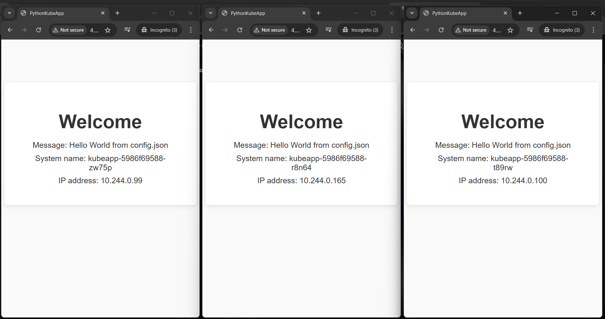

# AKS CI/CD Project with Terraform, GitHub Actions, and Docker

This repository demonstrates a complete CI/CD pipeline for deploying a Python application to **Azure Kubernetes Service (AKS)** using **Terraform**, **GitHub Actions**, **Azure Container Registry (ACR)**, and **Docker**.
---
## Table of Contents
- [Project Overview](#project-overview)  
- [Architecture](#architecture)  
- [Prerequisites](#prerequisites)  
- [Terraform Infrastructure](#terraform-infrastructure)  
- [GitHub Actions Pipelines](#github-actions-pipelines)  
  - [Infra Pipeline](#infra-pipeline)  
  - [Deploy Pipeline](#deploy-pipeline)  
- [Docker Image Tagging](#docker-image-tagging)  
- [Accessing the Application](#accessing-the-application)  
- [Notes & Best Practices](#notes--best-practices)
---
## Project Overview
This project automates:
1. Provisioning of Azure resources (Resource Group, AKS cluster, ACR) using **Terraform**.  
2. Continuous integration and deployment of a Python application via **GitHub Actions**.  
3. Docker image builds and pushes to **Azure Container Registry**.  
4. Deployment of Kubernetes manifests (`Deployment` and `Service`) to AKS.
---
##  Architecture

| Stage | Component | Description |
|-------|-----------|-------------|
| **1** | **GitHub Actions (CI/CD)** | Automated pipeline triggers on code changes |
| **2** | **Azure Container Registry (ACR)** | Stores and manages Docker container images |
| **3** | **Azure Kubernetes Service (AKS) Cluster** | Managed Kubernetes orchestrator |
| **4** | **Pods & Services** | Application containers and network endpoints |
| **5** | **External Access via LoadBalancer** | Public endpoint for user access |

- **Terraform** provisions:
  - Resource Group  
  - Container Registry  
  - AKS Cluster  
  - Role assignment for AKS to pull images from ACR
- **GitHub Actions**:
  - **Infra Pipeline:** Terraform `init`, `plan`, `apply`
  - **Deploy Pipeline:** Docker build, push, Kubernetes deployment
---
## Prerequisites
- Azure subscription with sufficient privileges  
- GitHub repository with **Secrets** set:
  - `AZURE_CREDENTIALS` → Service Principal JSON  
  - `ARM_SUBSCRIPTION_ID` → (optional for Terraform)  
- Local or CI environment with:
  - `kubectl`
  - `az` CLI
  - `docker`
---
## Terraform Infrastructure
**Files:**
- `main.tf` → defines resources  
- `variables.tf` → project variables  
- `terraform.tf` → provider configuration  

**Key Resources:**
- azurerm_resource_group
- azurerm_container_registry
- azurerm_kubernetes_cluster
- azurerm_role_assignment  

**Outputs:**
- acr_login_server
- aks_name
> After running Terraform, the infra is ready and AKS has permission to pull images from ACR.
---
## GitHub Actions Pipelines
### Infra Pipeline (`infra.yml`)
- Trigger: push to `master` in `terraform/**`  
- Steps:
  1. Checkout repository
  2. Setup Terraform
  3. Azure login
  4. Terraform init, plan, apply
**Note:** The SP must have **Owner** privileges at the subscription level or sufficient permissions to assign roles.
### Deploy Pipeline (`deploy.yml`)
- Trigger: push to `master` for application files (`app.py`, `Dockerfile`, `k8s/**`, etc.)  
- Steps:
  1. Checkout code
  2. Azure login
  3. Set AKS context (kubeconfig)
  4. Login to ACR
  5. Build Docker image
  6. Push Docker image
  7. Update Kubernetes deployment YAML (`IMAGE_PLACEHOLDER` replaced with built image tag)
  8. Deploy both Deployment & Service to AKS
  9. Optional: verify deployment
---
## Docker Image Tagging
- Images are tagged using **GitHub Actions run number**:
IMAGE=mycontainerregistry.azurecr.io/myapp:v${{ github.run_number }}
- Advantages:
  - Incremental versioning (`v1`, `v2`, `v3`)  
  - Easy to reference deployed version in AKS  
---
## Accessing the Application
1. Check that pods and services are running:
kubectl get pods
kubectl get svc
2. Look for your `Service` of type `LoadBalancer`:
NAME       TYPE           CLUSTER-IP     EXTERNAL-IP     PORT(S)
kubeapp    LoadBalancer   10.0.23.157   20.44.12.123   80:31445/TCP
- **EXTERNAL-IP** → public IP assigned by Azure  
- Open in browser: `http://<EXTERNAL-IP>`  
> Note: First-time provisioning can take 1–3 minutes for LoadBalancer IP to appear.
---

## Deployment Screenshot

Here’s a screenshot of the app running successfully:

Since we've set the replicas as `3`, we can see the load balancer trying to distribute the load among the three replicas.

## References
- [Azure Kubernetes Service Documentation](https://learn.microsoft.com/en-us/azure/aks/)  
- [Terraform Azure Provider](https://registry.terraform.io/providers/hashicorp/azurerm/latest/docs)  
- [GitHub Actions for Azure](https://github.com/Azure/actions)  
---